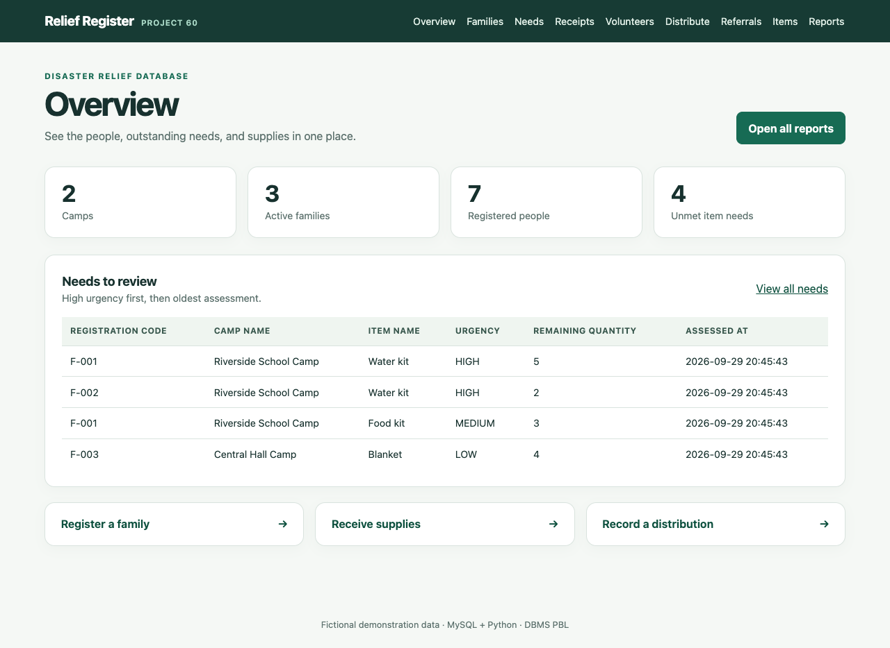
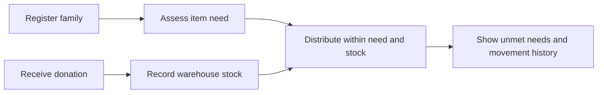

# Disaster Relief Resource and Camp Management System

**DBMS Project Based Learning · Project 60**

Relief teams often track camp residents, requested supplies, donations, stock, and distributions in separate registers. This project designs one relational database so a team can see what each family still needs, what is available, and what has already been issued.

The distinctive feature is a **transparent unmet-needs queue**: urgent requests appear first, then older requests. The database prototype will check distributions against recorded need and available stock, and make every stock change traceable. This uses ordinary relational design, SQL queries, constraints, and transactions.

**Chosen stack:** MySQL database and a small Python application. The design uses basic forms and reports; it does not require AI, maps, or cloud services.

## Review progress

| Review | Due in assignment | Evidence | Status |
| --- | --- | --- | --- |
| [1 · Design](https://github.com/sathvikmallepalli-lgtm/disaster-relief-dbms-pbl/issues/1) | Week 7 · 5 marks | Problem, scope, requirements, ERD, initial relational schema | Ready for discussion |
| [2 · Database prototype](https://github.com/sathvikmallepalli-lgtm/disaster-relief-dbms-pbl/issues/2) | Week 11 · 5 marks | 3NF, data dictionary, DDL, sample data, SQL reports, prototype | Ready for discussion |
| [3 · Application](https://github.com/sathvikmallepalli-lgtm/disaster-relief-dbms-pbl/issues/3) | Week 16 · 5 marks | Python app, CRUD, validation, reports, screenshots, final report, viva | Ready for discussion |

Start with the [Review 1 evidence](docs/review-1/README.md), then run the [Review 2 MySQL prototype](docs/review-2/README.md) and [Review 3 Python app](docs/review-3/README.md). The [review roadmap](docs/roadmap.md) maps the assignment to each stage.

**GitHub checkpoints:** [Review 1 design](https://github.com/sathvikmallepalli-lgtm/disaster-relief-dbms-pbl/tree/review-1-design-draft) · [Review 2 verified database](https://github.com/sathvikmallepalli-lgtm/disaster-relief-dbms-pbl/tree/review-2-verified) · [Review 3 app](https://github.com/sathvikmallepalli-lgtm/disaster-relief-dbms-pbl/tree/review-3-ready). Each review also has a linked issue in the table above for professor feedback.



## Core workflow



1. Register a disaster, camp, family, and family members.
2. Record a family's item needs and urgency for a relief round.
3. Receive donated items into a warehouse and record stock movement.
4. Assign volunteers to camps without overlapping time slots.
5. Issue items against a recorded need, within the remaining need and stock balance.
6. View unmet needs, camp population, stock, distribution history, donor contributions, volunteer work, and referrals.

## Repository map

```text
docs/
  roadmap.md             Review-by-review evidence plan
  review-1/
    README.md            Problem, scope, users, requirements, rules
    erd.md               Conceptual ER diagram
    schema.md            Initial relational schema
    walkthrough.md       Short presentation walkthrough
  review-2/
    README.md            Database setup and demonstration
    normalization.md     Functional dependencies and 3NF
    data-dictionary.md   Field meanings
  review-3/
    README.md            App setup, walkthrough, output screens
    report.md            Final project report
    viva.md              Viva preparation
    test-evidence.md     Checked integration results
database/
  schema.sql             MySQL tables, constraints, and views
  seed.sql               Fictional sample data
  reports.sql            Join, subquery, aggregation, and view examples
scripts/
  prototype.py           Command-line database demonstration
app/
  web.py                 Python web interface
  services.py            Business rules and transactions
tests/
  test_workflow.py       MySQL integration checks
```

All example names and records are fictional. Follow the [Review 3 setup](docs/review-3/README.md#run-it-locally) to run the full application.

## Assignment source

Project 60 in `DBMS_PBL_70_Unique_Project_Statements.docx`: “Design and Implementation of a Database Management System for Disaster Relief Resource and Camp Management System.” The assignment permits MySQL, PostgreSQL, or Oracle for the database and Java or Python for the application. This project uses MySQL and Python.
