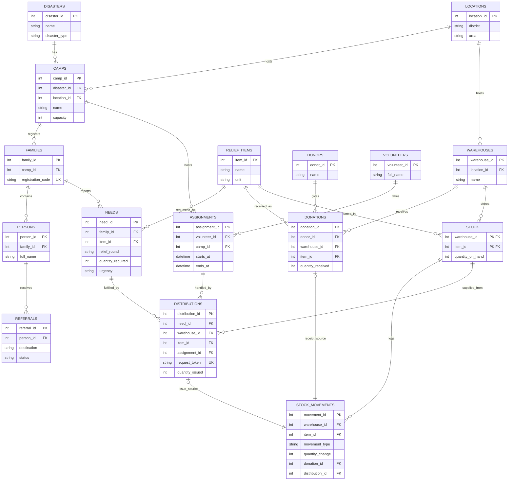

# Conceptual ER Diagram

The diagram includes every principal entity named in Project 60. `DONORS` and `STOCK_MOVEMENTS` are added to support donor reporting and traceable receipts/issues. A relief round is stored as a code on each need so the same family can be assessed again later.

`STOCK` is identified by the pair `(warehouse_id, item_id)`. A distribution uses the stock row for the requested item's `item_id` and selected warehouse. The database transaction will check this relationship and write the corresponding `STOCK_MOVEMENTS` row.

The `ASSIGNMENTS` link records which scheduled volunteer handled a distribution. The application will check that the assignment belongs to the family's camp and is active at the distribution time.
