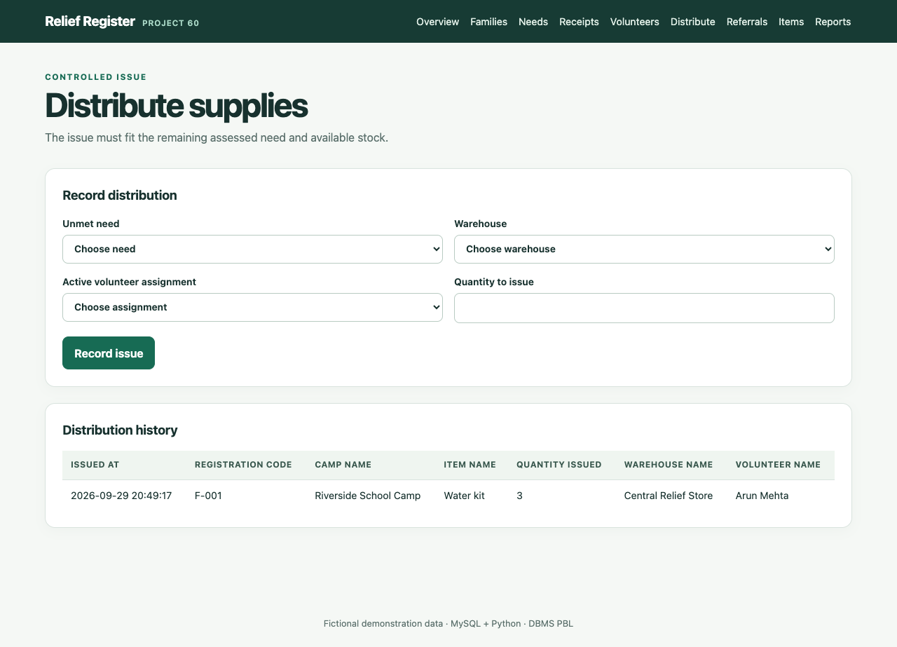
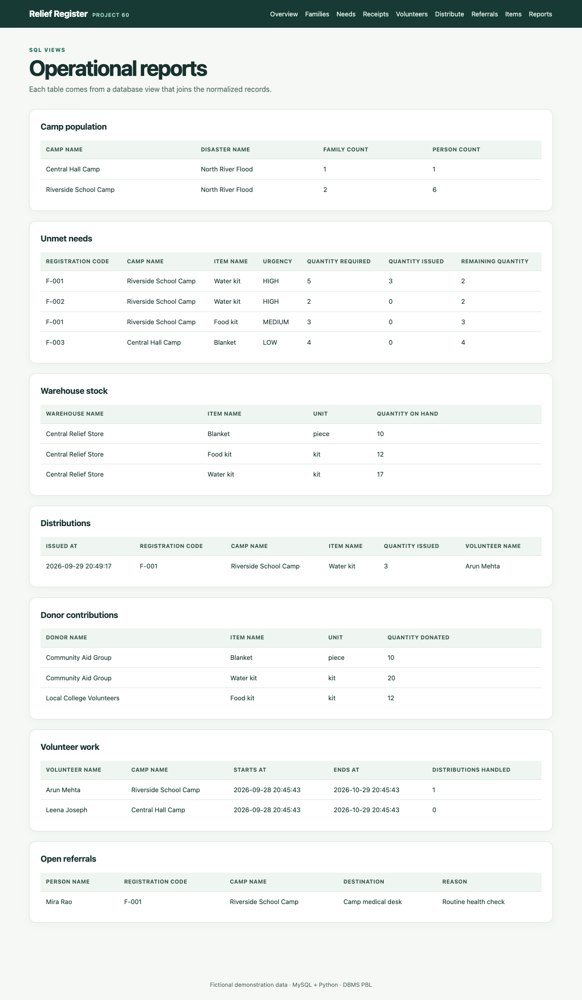

# Review 3 · Python Application and Final Demonstration

The application is a small local Python web interface backed by MySQL. It reuses the transaction rules demonstrated in [Review 2](../review-2/README.md). It has ordinary forms, tables, search, and SQL-based reports; no AI, cloud account, or map service is needed.

## Run it locally

First create and seed the database using the four MySQL commands in the [Review 2 setup](../review-2/README.md#set-up-a-local-demonstration-database). Then, from the repository root:

```bash
python3 -m venv .venv
.venv/bin/python -m pip install -r requirements.txt
export DB_HOST=127.0.0.1 DB_PORT=3306 DB_NAME=disaster_relief DB_USER=root
export DB_PASSWORD='your-local-password'
.venv/bin/python -m app.web
```

Open `http://127.0.0.1:5000`. The server listens only on the local computer. If port 5000 is occupied, set `APP_PORT` to another port before starting it. If your MySQL installation uses a Unix socket, set `DB_SOCKET` instead of `DB_HOST` and `DB_PORT`. Set `FLASK_SECRET_KEY` to a random local value if you want form sessions to survive app restarts.

## Working screens

| Screen | Purpose |
| --- | --- |
| Overview | Camp, family, person, and unmet-need totals plus the explainable priority queue |
| Families | Register a family, search by code, view members and needs, add more members |
| Needs | Assess quantity and urgency for a family, item, and relief round |
| Receipts | Add donors, receive items, and record stock movement |
| Volunteers | Add volunteers and assign them to a camp without overlapping intervals |
| Distribute | Issue an item against a need using an active volunteer assignment and available warehouse stock |
| Referrals | Refer a person and update follow-up status |
| Items | Create, read, update, and delete catalogue items; foreign keys protect items already used |
| Reports | Camp population, unmet needs, stock, distributions, donor totals, volunteer work, open referrals |

## Demonstration sequence

1. Show the **Overview** and explain that high urgency and earlier assessments appear first.
2. Register a fictional family and add its members. Search the family code to show retrieval.
3. Assess a water-kit need for the current relief round. Explain why the same family/item/round cannot be assessed twice.
4. Receive water kits from a donor and show the increased stock in **Reports**.
5. Add a volunteer and assign them to the family's camp for a current time interval. An overlapping second assignment is rejected.
6. Distribute part of the family's need. The issue appears in history, remaining need falls, and stock falls by the same quantity.
7. Try to issue more than the remaining need or available stock. The app shows a clear rejection without changing any rows.
8. Record a referral, update its status, then show the final reports.

The [final report](report.md) explains the design and results. The [viva notes](viva.md) prepare for common database questions.

## Output screens

The screenshots use fictional demonstration data. The overview shows the queue before an issue; the later images show a three-kit issue and updated reports.






## Test the main rules

Create a **fresh disposable** database with a name beginning `dbms_pbl_test_`, load `schema.sql` and `seed.sql` into it, export its name as `DB_NAME`, and run:

```bash
.venv/bin/python -m unittest discover -s tests -v
```

The tests cover concurrent issues, duplicate assessments and receipts, stock movement and reconciliation, duplicate or excess distributions, wrong-camp assignments, volunteer overlap, all main pages, form protection, and item CRUD. See [test evidence](test-evidence.md) for the checked result.
